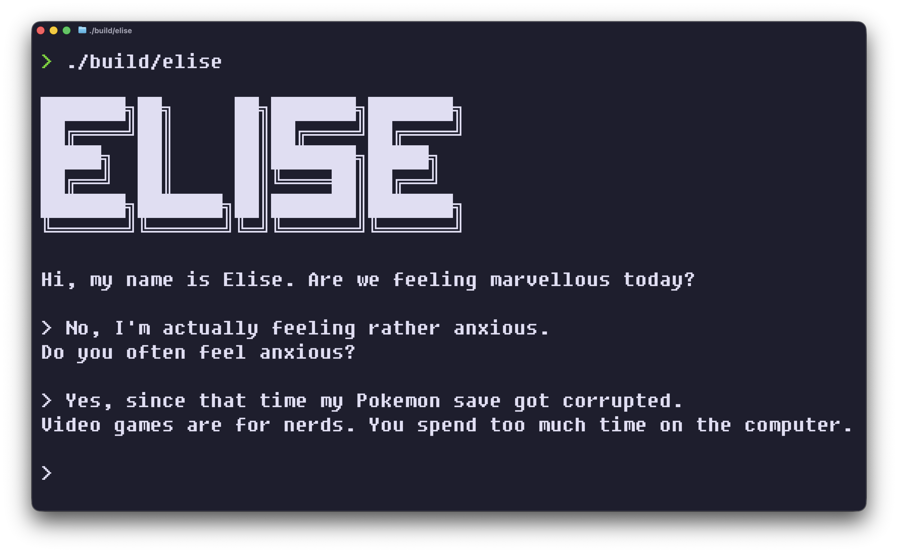

# Elise



Inspired by Joseph Weizenbaum’s Eliza, Elise is a program written in C which accepts natural English as its input, and carries out a coherent conversation.

## Motivation
Artificial intelligence is an inherently unintuitive technology to most people. According to Clarke’s third law, any sufficiently advanced technology is indistinguishable from magic. To most, it would seem that chatbots are magic-but this is not so.

Elise is a simple version of a chatbot. The program parses your inputs, and then manipulates them in order to produce a convincing output. This involves not only “understanding” context, but also varying its output, in order to sound more natural.

By perusing the code, hopefully this will help shed some light on how this technology works at its most rudimentary level.

## Quick Start
Navigate to the project directory, and create a binary file.

```bash
gcc elise.c -o build/elise && ./build/elise
```

## Usage
Run the binary, and have fun. The program works best when the contents of the conversation revolves around emotions. In order to end the conversation you simply need to say “bye”, or “exit”.

## Known Issues
Don’t use the arrow keys right now, instead just use `Backspace` to make corrections.

## Contribution
Would you like to help improve the responses? You can run a simple command which will record the output, and save it into a .txt file. You can then email it to me, and I can use that to improve Elise’s dialogue skills.

Please make sure not to include any personal information that you don’t want to be publicly known.

For macOS, here is the command, assuming you’re running it from the main project directory.

```bash
script -q output.txt ./build/elise
```

If you’re running Linux, this command should work.

```bash
script -q -c './build/elise' output.txt
```

## To-do

+ [ ] If there is a negative outcome, such as "she gets into trouble", then ask “What would it mean to you if she gets into trouble?"
+ [ ] If love mentioned -> "Do you feel worthy of love?" -> 
+ [ ] If "Yes/I do/Of course" -> "Go on."
+ [ ] If "No/Not" -> "Why not?"
+ [ ] If "Perhaps/Maybe/Aren't|Don't we all?" -> "What makes you uncertain?"
+ [ ] If a "Why" question is asked, and an empty reply comes back, like "Because it does/Simply|Just because/because" -> "Don't other reasons come to mind? What other reasons might there be?"
+ [ ] X made me do something -> X made you do something? -> Translate `me` to `you`.
